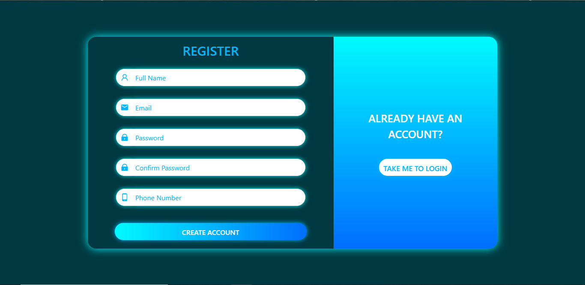

<br />
<p align="center">
  <a href="https://github.com/KelvinMitaki/busara">
    
  </a>

  <h3 align="center">Busara README</h3>

  <p align="center">
    An awesome README documenting a survey project.
    <br />
    <br />
    <a href="https://busara.vercel.app">View Demo</a>
    ·
    <a href="https://github.com/KelvinMitaki/busara/issues">Report Bug</a>
    ·
    <a href="https://github.com/KelvinMitaki/busara/issues">Request Feature</a>
  </p>
</p>

<details open="open">
  <summary>Table of Contents</summary>
  <ol>
    <li>
      <a href="#about-the-project">About The Project</a>
      <ul>
        <li><a href="#built-with">Built With</a></li>
      </ul>
    </li>
    <li>
      <a href="#getting-started">Getting Started</a>
      <ul>
        <li><a href="#prerequisites">Prerequisites</a></li>
        <li><a href="#installation">Installation</a></li>
      </ul>
    </li>
    <li><a href="#usage">Usage</a></li>
    <li><a href="#contributing">Contributing</a></li>
    <li><a href="#contact">Contact</a></li>
  </ol>
</details>

## About The Project

<!--
[![busara screenshot][busara screenshot]](<https://e-commerce-gig.s3.eu-west-2.amazonaws.com/Screenshot+(86).png>) -->

### Built With

- [React](https://reactjs.org/docs/getting-started.html)
- [NextJS](https://nextjs.org/docs/getting-started)
- [Redux](https://redux.js.org/introduction/getting-started)

## Getting Started

For this project to run, just clone the repo and install all dependencies then run command

```sh
npm run dev
```

### Prerequisites

The project was built with JavaScript language so you need Node installed then to install all dependencies, you need to run command

- npm
  ```sh
  npm install
  ```

### Installation

2. Clone the repo
   ```sh
   git clone https://github.com/KelvinMitaki/busara.git
   ```
3. Install NPM packages
   ```sh
   npm install
   ```
4. Enter your API keys in `config/keys.env`
   ```env
   API_KEY=ENTER YOUR API KEY
   ```

## Usage

Once you have your API keys setup, run the project in the browser.

There are three main pages:

- [Authenticate Page](https://busara.vercel.app/authenticate)
  The authenticate page has both login and register components which are determined by the current state of the site. The default state shows the login component. If the user presses `take me to register`, the register component replaces the login component. A smooth animation is shown with CSS transitions and keyframes.

**Register**
<br/>
In order for a user to register, he/she must provide all the credentials needed, that is:

- full name
- email
- password
- confirm password
- phone number

Validation is done on the frontend before the form is submitted to the backend. The email must be a valid email address. Password and confirm password must match and not be less than six characters. The phone number must be a valid kenyan phone number starting with `2547`. If a phone number is already in use, an error will be generated from the backend which is shown nicely to the user on the frontend.

<br/>
<a href="https://e-commerce-gig.s3.eu-west-2.amazonaws.com/5efd9987b53dfa39cc27bae9/Screenshot+(102).png">

</a>

**Login**
<br/>
In order for a user to login, he/she must provide all the credentials needed, that is:

- email
- password

The email is validated to be a valid email before form submission. Password validation is also done to ensure password is more than six characters. Incase of an invalid email or password, the user is notified on the frontend with an error message stating that `invalid email or password`. The message is generic to ensire that a malicious user doesn't try to guess a user's email and password.

<a href="https://e-commerce-gig.s3.eu-west-2.amazonaws.com/5efd9987b53dfa39cc27bae9/Screenshot+(103).png">

</a>

- [Profile Page](https://busara.vercel.app/profile)

**Profile**
<br/>

After a user has logged in successfully, he/she is redirected to the profile page where they can view their user data. A user can also log out of the site where the auth token is cleared and the user is redirected to authenticate page.

<a href="https://e-commerce-gig.s3.eu-west-2.amazonaws.com/5efd9987b53dfa39cc27bae9/Screenshot+(97).png">

</a>

- [Survey Page](https://busara.vercel.app)

**Survey**
<br/>

This is the main page which entails the survey. The surevey is fetched dynamically from the server and rendered for the currently logged in user to answer the question. After filling out the questions in the survey, a user can then submit the form. Pagination is also included depending on the number of questions fetched from the server.

<a href="https://e-commerce-gig.s3.eu-west-2.amazonaws.com/5efd9987b53dfa39cc27bae9/Screenshot+(99).png">

</a>
<br/>
After a successful form submission, the user is notified that the form was successfully submitted.
<a href="https://e-commerce-gig.s3.eu-west-2.amazonaws.com/5efd9987b53dfa39cc27bae9/Screenshot+(105).png">

</a>
<br/>
Incase of an error on form submission, the user is notified to reload the browser and try again or after some time. In this case, we assume that the user is having network issues from his/her side or there's an internal server error.
<a href="https://e-commerce-gig.s3.eu-west-2.amazonaws.com/5efd9987b53dfa39cc27bae9/Screenshot+(106).png">

</a>

<!-- [![profile page screenshot][profile page screenshot]](<https://e-commerce-gig.s3.eu-west-2.amazonaws.com/Screenshot+(92).png>) -->

## Contributing

Contributions are what make the open source community such an amazing place to be learn, inspire, and create. Any contributions you make are **greatly appreciated**.

1. Fork the Project
2. Create your Feature Branch (`git checkout -b feature/AmazingFeature`)
3. Commit your Changes (`git commit -m 'Add some AmazingFeature'`)
4. Push to the Branch (`git push origin feature/AmazingFeature`)
5. Open a Pull Request

## Contact

Kelvin Mitaki - [@linkedin](https://www.linkedin.com/in/kelvinmitaki) - mitakikelvin1@gmail.com

Project Link: [https://github.com/KelvinMitaki/busara](https://github.com/KelvinMitaki/busara)
