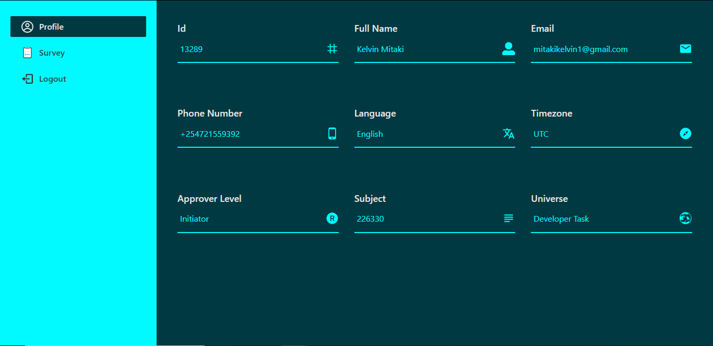

<br />
<p align="center">
  <a href="https://github.com/KelvinMitaki/busara">
    
  </a>

  <h3 align="center">Busara README</h3>

  <p align="center">
    An awesome README documenting a survey project.
    <br />
    <br />
    <a href="https://busara.vercel.app">View Demo</a>
    ·
    <a href="https://github.com/KelvinMitaki/busara/issues">Report Bug</a>
    ·
    <a href="https://github.com/KelvinMitaki/busara/issues">Request Feature</a>
  </p>
</p>

<details open="open">
  <summary>Table of Contents</summary>
  <ol>
    <li>
      <a href="#about-the-project">About The Project</a>
      <ul>
        <li><a href="#built-with">Built With</a></li>
      </ul>
    </li>
    <li>
      <a href="#getting-started">Getting Started</a>
      <ul>
        <li><a href="#prerequisites">Prerequisites</a></li>
        <li><a href="#installation">Installation</a></li>
      </ul>
    </li>
    <li><a href="#usage">Usage</a></li>
    <li><a href="#contributing">Contributing</a></li>
    <li><a href="#contact">Contact</a></li>
  </ol>
</details>

## About The Project

<!--
[![busara screenshot][busara screenshot]](<https://e-commerce-gig.s3.eu-west-2.amazonaws.com/Screenshot+(86).png>) -->
 <a href="https://e-commerce-gig.s3.eu-west-2.amazonaws.com/Screenshot+(86).png">
    
  </a>

### Built With

- [React](https://reactjs.org/docs/getting-started.html)
- [NextJS](https://nextjs.org/docs/getting-started)
- [Redux](https://redux.js.org/introduction/getting-started)

## Getting Started

For this project to run, just clone the repo and install all dependencies then run command

```sh
npm run dev
```

### Prerequisites

The project was built with JavaScript language so you need Node installed then to install all dependencies, you need to run command

- npm
  ```sh
  npm install
  ```

### Installation

2. Clone the repo
   ```sh
   git clone https://github.com/KelvinMitaki/busara.git
   ```
3. Install NPM packages
   ```sh
   npm install
   ```
4. Enter your API keys in `config/keys.env`
   ```env
   API_KEY=ENTER YOUR API KEY
   ```

## Usage

Once you have your API keys setup, run the project in the browser. Register and Login to the site. The site is all about collection on survey data. Fill in all the required fields in the form then submit it. You can also view your profile with the registered information as shown in the image below.

<!-- [![profile page screenshot][profile page screenshot]](<https://e-commerce-gig.s3.eu-west-2.amazonaws.com/Screenshot+(92).png>) -->
 <a href="https://e-commerce-gig.s3.eu-west-2.amazonaws.com/5efd9987b53dfa39cc27bae9/Screenshot+(97).png">
    
  </a>

## Contributing

Contributions are what make the open source community such an amazing place to be learn, inspire, and create. Any contributions you make are **greatly appreciated**.

1. Fork the Project
2. Create your Feature Branch (`git checkout -b feature/AmazingFeature`)
3. Commit your Changes (`git commit -m 'Add some AmazingFeature'`)
4. Push to the Branch (`git push origin feature/AmazingFeature`)
5. Open a Pull Request

## Contact

Kelvin Mitaki - [@linkedin](https://www.linkedin.com/in/kelvinmitaki) - mitakikelvin1@gmail.com

Project Link: [https://github.com/KelvinMitaki/busara](https://github.com/KelvinMitaki/busara)
